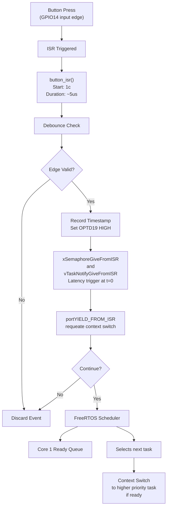

# ELVESTER-FINAL-RTS26Summer — Real-Time Systems Final Capstone

## One sentence
This system is to ensure that a power grid can swiftly detect a fault and log the events for proper documentation.

## Demo
- Video:<Link Here> 
- Wokwi: https://wokwi.com/projects/470133235085597697
- Live Wokwi: ELVESTER-FINAL-RTS26Summer

## Architecture
// From Here till next // was AI assisted
## Core 0: ISR Context Flow

The following diagram illustrates the interrupt service routine (ISR) handling on Core 0 when a button press is detected:



**Key Timing:**
- Button ISR: ~5 microseconds
- Debounce check validates edge timing
- Semaphore/notification triggers scheduler on Core 1

---

## Core 1: Rate-Monotonic Schedule

The rate-monotonic schedule for Core 1 defines task periods, priorities, and the ISR/bottom-half event handling:

| Task            | Period   | Priority | Description                |
|-----------------|----------|----------|----------------------------|
| **load_task_a** | P=15 ms  | T=10 ms  | Executes every 10 ms slice |
| **load_task_b** | P=20 ms  | T=20 ms  | Repeats every 20 ms        |
| **load_task_c** | P=50 ms  | T=50 ms  | Repeats every 50 ms        |
| **load_task_d** | P=100 ms | T=100 ms | Repeats every 100 ms       |

### Task Execution Timeline

```
Time (ms):  0      10     20     30     40     50     60     70     80     90    100
           |------|------|------|--------|------|------|------|------|------|------|
load_task_a [=====]                    [=====]            [=====]            [=====]
load_task_b            [==========]           [==========]           [==========]
load_task_c                                  [==================]           [====]
load_task_d                                                    [===========================]
ISR Event   ^                              ^                   ^              
(Button)    t=0                           t=40                t=80
```

**Timeline Details:**
- `load_task_a`: Executes at 0ms, 20ms, 40ms, 60ms, 80ms, 100ms (P=15ms repeating in 10ms slots)
- `load_task_b`: Executes at 0ms-20ms, then 20ms-40ms, 40ms-60ms, etc. (P=20ms)
- `load_task_c`: Executes at 40ms-90ms, 90ms-140ms (P=50ms)
- `load_task_d`: Executes at 100ms+ (P=100ms)
- **ISR Events** trigger context switches to high-priority tasks

### Event Handling

**Higher Priority Events (Preemption triggered):**
- **btn_task_sem** (P=12): Binary Semaphore unlocks at t=0 ± latency
- **btn_task_notif**: Direct Notification unblocks at t=0

**Lower Priority Background Tasks:**
- Load tasks fill remaining CPU time when higher priority tasks idle
- Periods: 15, 20, 50, 100 ms with staggered execution

### Latency Measurements

| Event | Latency | Notes |
|-------|---------|-------|
| Button edge ISR | ≈ 5 µs | Debounce check validates edge timing |
| xSemaphoreGiveFromISR | t = 0 ± Δ | Response latency: t = 0 - Δ |
| uTaskNotifyGiveFromISR | t = 0 ± Δ | Response latency: t = 0 - Δ |

---

## System Integration

1. **Button Press Detection** (Core 0):
   - GPIO interrupt triggers ISR
   - Debounce validation ensures clean edges
   - Timestamp recorded at OPTD19
   - Semaphore/notification triggers Core 1 scheduler

2. **Task Scheduling** (Core 1):
   - Context switch to highest priority ready task
   - Rate-monotonic prioritization ensures deadline compliance
   - Background load tasks fill idle CPU cycles
   - Preemption latency measured for real-time compliance

//
**Architecture insights**
The system operates on a button ISR which records time of input and then signals the next tasks. These tasks then go based on the priority hierarchy decided with or without inheritance.

## Tasks & timing (WCET evidence)
Using Full Task Breakdown from App 2
| Task | Function               | Period (ms) | WCET measured (ms) | Deadline | Priority |
|------|------------------------|------------:|-------------------:|---------:|---------:|
| A    |Fault Sweeping Monitor  | 10          | 0.601              | 10 ms    | 15       | 
| B    |Classify Fault Status   | 25          | 0.237              | 25 ms    | 10       |
| C    |Indicator Update        | 50          | 8.639              | 50 ms    | 5        |
| D    |Grid Health Log         | 200         | 69.293             | 200 ms   | 2        | 

Total utilization U = 0.59  (U = 0.591 ≤ RM bound (0.757). Schedulable under Rate-Monotonic and EDF (independent periodic tasks, deadline = period).)

## Hazard analysis & standard mapping
The most vital hazard to be aware of is a missed or delayed fault recognition. This risk is reduced via the utilization of the interrupt based ISR. The application also adopts high priority fault monitoring and real time logging of the tasks.

## Graceful degradation
If the processor gets too heavily used, the high priority tasks are still able to clear on time. This is possible via preemption. This allows fault monitoriing to continue with only minor delays.

## Build & run
Toolchain: FreeRTOS with the ESP IDF
Board: ESP32 simulated using Wokwi
How to reproduce: Trigger Button ISR alternating between WITH_LOAD 0 and 1 with the simulator active.

## Tailored for
Embedded Power Systems Engineer - This entire project is about designing a system to reliably monitor a localized Power Grid in a reliable fashion.

