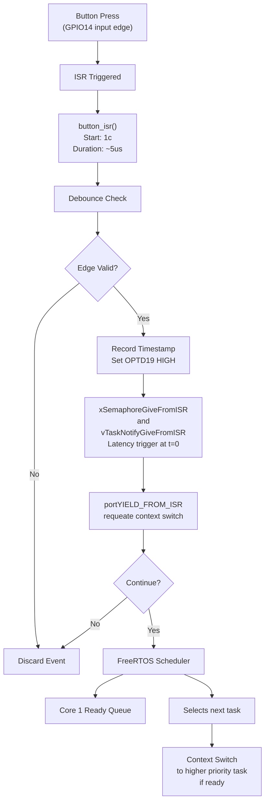

# RTS_Capston — Real-Time Systems Final Capstone

## One sentence
This system is to ensure that a power grid can swiftly detect a fault and log the events for proper documentation.

## Demo
- Video: <YouTube / Wokwi link>
- Live Wokwi: ELVESTER-FINAL-RTS26Summer

## Architecture
<diagram + 2–3 sentences on the data/control flow>

# FreeRTOS System Architecture

## Core 0: ISR Context Flow

The following diagram illustrates the interrupt service routine (ISR) handling on Core 0 when a button press is detected:



**Key Timing:**
- Button ISR: ~5 microseconds
- Debounce check validates edge timing
- Semaphore/notification triggers scheduler on Core 1

---

## Core 1: Rate-Monotonic Schedule

The rate-monotonic schedule for Core 1 defines task periods, priorities, and the ISR/bottom-half event handling:

| Task | Period | Priority | Description |
|------|--------|----------|-------------|
| **load_task_a** | P=15 ms | T=10 ms | Executes every 10 ms slice |
| **load_task_b** | P=20 ms | T=20 ms | Repeats every 20 ms |
| **load_task_c** | P=50 ms | T=50 ms | Repeats every 50 ms |
| **load_task_d** | P=100 ms | T=100 ms | Repeats every 100 ms |

### Task Execution Timeline

```
Time (ms):  0      10     20     30     40     50     60     70     80     90    100
           |------|------|------|------|------|------|------|------|------|------|
load_task_a [=====]                    [=====]            [=====]            [=====]
load_task_b            [==========]           [==========]           [==========]
load_task_c                                  [==================]           [====]
load_task_d                                                    [===========================]
ISR Event   ^                              ^                   ^              
(Button)    t=0                           t=40                t=80
```

**Timeline Details:**
- `load_task_a`: Executes at 0ms, 20ms, 40ms, 60ms, 80ms, 100ms (P=15ms repeating in 10ms slots)
- `load_task_b`: Executes at 0ms-20ms, then 20ms-40ms, 40ms-60ms, etc. (P=20ms)
- `load_task_c`: Executes at 40ms-90ms, 90ms-140ms (P=50ms)
- `load_task_d`: Executes at 100ms+ (P=100ms)
- **ISR Events** trigger context switches to high-priority tasks

### Event Handling

**Higher Priority Events (Preemption triggered):**
- **btn_task_sem** (P=12): Binary Semaphore unlocks at t=0 ± latency
- **btn_task_notif**: Direct Notification unblocks at t=0

**Lower Priority Background Tasks:**
- Load tasks fill remaining CPU time when higher priority tasks idle
- Periods: 15, 20, 50, 100 ms with staggered execution

### Latency Measurements

| Event | Latency | Notes |
|-------|---------|-------|
| Button edge ISR | ≈ 5 µs | Debounce check validates edge timing |
| xSemaphoreGiveFromISR | t = 0 ± Δ | Response latency: t = 0 - Δ |
| uTaskNotifyGiveFromISR | t = 0 ± Δ | Response latency: t = 0 - Δ |

---

## System Integration

1. **Button Press Detection** (Core 0):
   - GPIO interrupt triggers ISR
   - Debounce validation ensures clean edges
   - Timestamp recorded at OPTD19
   - Semaphore/notification triggers Core 1 scheduler

2. **Task Scheduling** (Core 1):
   - Context switch to highest priority ready task
   - Rate-monotonic prioritization ensures deadline compliance
   - Background load tasks fill idle CPU cycles
   - Preemption latency measured for real-time compliance

## Tasks & timing (WCET evidence)
Using Full Task Breakdown from App 2
| Task | Period T | WCET C | U=C/T | Priority | Deadline |
|------|---------:|-------:|------:|---------:|---------:|
<rows from the calculator>
Total utilization U = <value>  (RM bound / EDF feasible: <note>)

## Hazard analysis & standard mapping
<hazard, effect, mitigation; mapped to the standard clause>

## Graceful degradation
<what fails, how it is detected, what the system does instead>

## Build & run
<toolchain, board, how to reproduce>

## Tailored for
<target role> — <why these choices fit that role>

